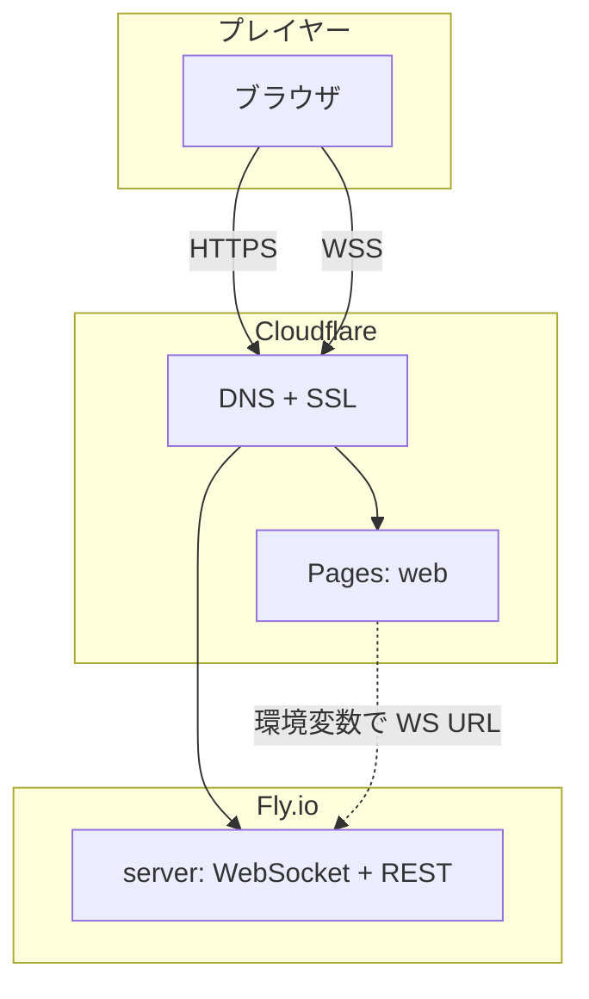
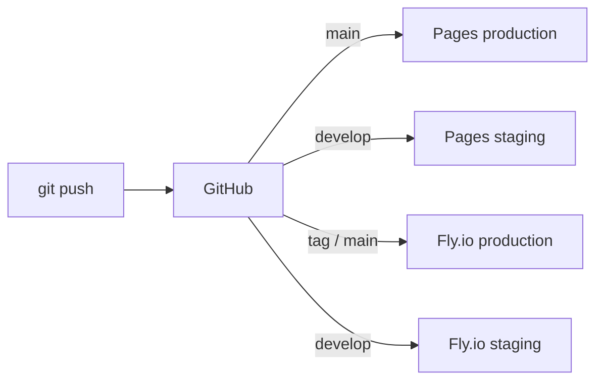

# 定時退社 Web — 本番デプロイ方針

> **確定日:** 2026-06-25  
> **サークルドメイン:** `mottainaigames.com`（Cloudflare 管理）

---

## 1. 確定した方針（サマリー）

| 項目 | 決定内容 |
|------|----------|
| URL 形式 | **サブドメイン** |
| URL スラッグ | **`teijitaisha-web`** |
| フロントホスト | **Cloudflare Pages** |
| ゲームサーバー | **Fly.io**（WebSocket 向き・無料枠あり） |
| リポジトリ構成 | **モノレポ**（`web` + `server` + `shared`） |
| 環境 | **production** + **staging** の2環境 |
| サークルドメイン | **`mottainaigames.com`** |
| 認証 | **ルームコードのみ**（アカウント不要） |

---

## 2. URL 設計（確定）

### Production

| 用途 | URL |
|------|-----|
| フロント（ゲーム画面） | **https://teijitaisha-web.mottainaigames.com** |
| ゲーム API（WebSocket） | **wss://api.teijitaisha-web.mottainaigames.com** |

### Staging

| 用途 | URL |
|------|-----|
| フロント | **https://teijitaisha-web-staging.mottainaigames.com** |
| ゲーム API | **wss://api.teijitaisha-web-staging.mottainaigames.com** |

### DNS レコード（Cloudflare / `mottainaigames.com`）

| 名前 | タイプ | 向き先 |
|------|--------|--------|
| `teijitaisha-web` | CNAME | Cloudflare Pages（production ブランチ） |
| `teijitaisha-web-staging` | CNAME | Cloudflare Pages（staging ブランチ） |
| `api.teijitaisha-web` | CNAME | Fly.io アプリ（production） |
| `api.teijitaisha-web-staging` | CNAME | Fly.io アプリ（staging） |

- プロキシ（オレンジ雲）: **ON**（SSL・CDN・DDoS 保護）
- Fly.io 側で SSL 証明書を自動発行（`fly certs add`）

> TLD が `.com` 以外の場合はお知らせください。DNS レコード名は同じです。

---

## 3. アーキテクチャ



| レイヤー | 技術 | 役割 |
|----------|------|------|
| フロント | Vite + React（または Next.js static） | UI・カード表示・ルーム参加 |
| 共有 | TypeScript `shared` | 型・カード定義・ルール定数 |
| サーバー | Node.js + `ws`（または Bun） | ルーム管理・ゲーム状態・EffectResolver |
| DNS/SSL | Cloudflare | ドメイン・HTTPS |
| 静的配信 | Cloudflare Pages | フロントのビルド成果物 |
| 常時接続 | Fly.io | WebSocket ゲームサーバー |

**Fly.io を選ぶ理由**

- WebSocket の長時間接続に向いている
- 東京リージョン（`nrt`）が使える（低レイテンシ）
- Docker 1本でデプロイでき、MVP から本番まで同じ形
- 無料枠あり（小規模サークル運用に十分なことが多い）

---

## 4. リポジトリ構成（モノレポ）

```
teijitaisha-web/
├── apps/
│   ├── web/                 # フロント（Vite + React）
│   │   ├── src/
│   │   ├── package.json
│   │   └── vite.config.ts
│   └── server/              # ゲームサーバー（Fly.io）
│       ├── src/
│       ├── Dockerfile
│       ├── fly.toml
│       └── package.json
├── packages/
│   └── shared/              # 共有型・定数・カード定義
│       ├── src/
│       └── package.json
├── package.json             # pnpm workspace ルート
├── pnpm-workspace.yaml
├── RULES_RECOGNITION.md
├── STATE_DIAGRAM.md
└── DEPLOYMENT.md
```

| 選択 | 理由 |
|------|------|
| **モノレポ** | フロントとサーバーで型・ルールを `shared` から共有。1 PR で整合が取れる |
| **pnpm workspace** | 軽量・高速。モノレポの定番 |

---

## 5. 環境（production / staging）

| 環境 | ブランチ | フロント URL | 用途 |
|------|----------|-------------|------|
| **staging** | `develop` | `teijitaisha-web-staging.mottainaigames.com` | 動作確認・友人テスト |
| **production** | `main` | `teijitaisha-web.mottainaigames.com` | 本番公開 |

### 環境変数

**`apps/web`（Cloudflare Pages）**

| 変数 | staging | production |
|------|---------|------------|
| `VITE_WS_URL` | `wss://api.teijitaisha-web-staging.mottainaigames.com` | `wss://api.teijitaisha-web.mottainaigames.com` |
| `VITE_ENV` | `staging` | `production` |

**`apps/server`（Fly.io）**

| 変数 | staging | production |
|------|---------|------------|
| `NODE_ENV` | `production` | `production` |
| `PORT` | `8080` | `8080` |
| `CORS_ORIGIN` | `https://teijitaisha-web-staging.mottainaigames.com` | `https://teijitaisha-web.mottainaigames.com` |
| `ROOM_CODE_LENGTH` | `6` | `6` |

---

## 6. 認証・ルーム

| 項目 | 方針 |
|------|------|
| ユーザーアカウント | **なし**（MVP） |
| ルーム参加 | **6桁のルームコード**（ホストが表示・共有） |
| ルーム作成 | 誰でも可。ホストが開始ボタンを押す |
| 座席 | ルーム設定どおり（ランダム or ホスト並べ替え） |

### ルームコード（実装指針）

- 英数字大文字 6桁（例: `A3K9X2`）— 読み間違いしにくい文字セット
- サーバー側で一意性を保証
- 未使用コードの有効期限: 24時間（staging は 1時間でも可）

---

## 7. デプロイフロー



| トリガー | デプロイ先 |
|----------|-----------|
| `main` への push | Pages production + Fly.io production |
| `develop` への push | Pages staging + Fly.io staging |

**CI（推奨）:** GitHub Actions

- `apps/web`: `pnpm build` → Cloudflare Pages（Git 連携で自動でも可）
- `apps/server`: `fly deploy`（Actions から `FLY_API_TOKEN` を使用）

---

## 8. Cloudflare 設定チェックリスト

- [ ] Pages プロジェクト作成（GitHub 連携）
- [ ] production ブランチ = `main`、カスタムドメイン `teijitaisha-web.mottainaigames.com`
- [ ] staging ブランチ = `develop`、カスタムドメイン `teijitaisha-web-staging.mottainaigames.com`
- [ ] ビルドコマンド: `pnpm --filter web build`
- [ ] 出力ディレクトリ: `apps/web/dist`
- [ ] 環境変数 `VITE_WS_URL` を環境ごとに設定

---

## 9. Fly.io 設定チェックリスト

- [ ] `fly launch`（リージョン: `nrt` 推奨）
- [ ] production アプリ名例: `teijitaisha-web-api`
- [ ] staging アプリ名例: `teijitaisha-web-api-staging`
- [ ] `fly certs add api.teijitaisha-web.mottainaigames.com`
- [ ] staging: `fly certs add api.teijitaisha-web-staging.mottainaigames.com`
- [ ] `CORS_ORIGIN` にフロント URL を設定
- [ ] ヘルスチェック: `GET /health` → `200 OK`

---

## 10. コスト目安（小規模）

| サービス | 想定 |
|----------|------|
| Cloudflare Pages | 無料枠内（帯域・ビルド数に注意） |
| Cloudflare DNS/SSL | 無料 |
| Fly.io | 無料枠 or 数ドル/月程度（同時接続・常時起動による） |

サークル規模（同時数ルーム・数十人）なら **ほぼ無料〜月数百円程度** が現実的。

---

## 11. MVP 実装順序（デプロイ込み）

1. モノレポ雛形（`web` / `server` / `shared`）
2. `shared` にカード定義・型
3. `server` にルーム作成・WebSocket 骨格・`/health`
4. **staging に先にデプロイ**（Fly + Pages）
5. `web` にルーム参加 UI
6. ゲームロジック実装（`STATE_DIAGRAM.md` に従う）
7. staging でプレイテスト
8. `main` マージ → production 公開

---

## 12. 未決定（後でよい）

| 項目 | メモ |
|------|------|
| GitHub リポジトリ名 | `teijitaisha-web` 推奨 |
| 同時ルーム数上限 | Fly のメモリに応じて後から調整 |
| analytics | MVP では不要。必要なら Cloudflare Web Analytics（無料） |

---

## 13. 関連ドキュメント

- [RULES_RECOGNITION.md](./RULES_RECOGNITION.md) — ゲームルール
- [STATE_DIAGRAM.md](./STATE_DIAGRAM.md) — 状態遷移・実装指針

---

*次のステップ: モノレポ雛形の作成 → staging への初回デプロイ*
