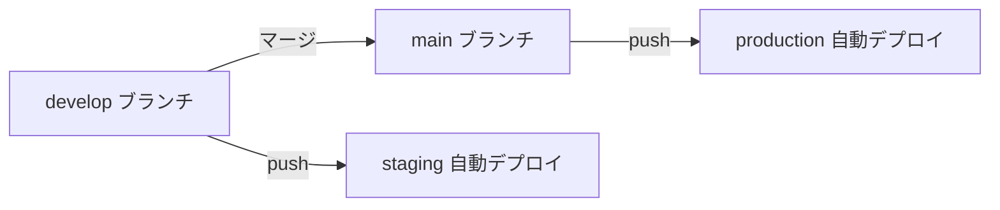

# Production デプロイ手順

> 対象 URL
>
> - Web: https://teijitaisha-web.mottainaigames.com
> - API: https://api.teijitaisha-web.mottainaigames.com

**前提:** [DEPLOY_STAGING.md](./DEPLOY_STAGING.md) の staging デプロイが完了していること。

---

## 概要

| 項目               | 内容                        |
| ------------------ | --------------------------- |
| ブランチ           | `main`                      |
| GitHub Environment | `production`                |
| Fly アプリ         | `teijitaisha-web-api`       |
| Pages プロジェクト | `teijitaisha-web`           |
| トリガー           | `main` への push / 手動実行 |

ワークフロー: [`.github/workflows/deploy.yml`](./.github/workflows/deploy.yml) の `deploy-production` ジョブ

---

## A. 初回のみ（インフラ）

### 1. Fly.io アプリ作成

```bash
fly apps create teijitaisha-web-api
```

> すでに存在する場合はスキップ。確認: `fly apps list | grep teijitaisha-web-api`

### 2. Cloudflare Pages プロジェクト作成

```bash
pnpm exec wrangler pages project create teijitaisha-web --production-branch=main
```

> すでに存在する場合はスキップ。確認: `pnpm exec wrangler pages project list`

### 3. 初回デプロイ（リモートビルダー起動）

```bash
cd ~/Desktop/定時退社web
unset DOCKER_HOST
fly deploy --config fly.toml --remote-only --buildkit
```

`https://teijitaisha-web-api.fly.dev/health` → `{"ok":true,...}` を確認。

### 4. Fly カスタムドメイン（API）

```bash
fly certs add api.teijitaisha-web.mottainaigames.com -a teijitaisha-web-api
fly certs setup api.teijitaisha-web.mottainaigames.com -a teijitaisha-web-api
```

表示された DNS を **Cloudflare**（`mottainaigames.com`）に追加。

**A / AAAA の場合（staging と同様）:**

| タイプ | 名前                  | 向き先              | プロキシ           |
| ------ | --------------------- | ------------------- | ------------------ |
| A      | `api.teijitaisha-web` | fly が表示した IPv4 | **DNS only（灰）** |
| AAAA   | `api.teijitaisha-web` | fly が表示した IPv6 | **DNS only（灰）** |

**証明書を早く発行する場合（ACME）:**

| タイプ | 名前                                  | 向き先                         | プロキシ |
| ------ | ------------------------------------- | ------------------------------ | -------- |
| CNAME  | `_acme-challenge.api.teijitaisha-web` | `fly certs setup` の表示どおり | DNS only |

```bash
fly certs check api.teijitaisha-web.mottainaigames.com -a teijitaisha-web-api
# Status = Ready になるまで待つ

curl https://api.teijitaisha-web.mottainaigames.com/health
```

### 5. Cloudflare Pages カスタムドメイン（Web）

1. Pages → `teijitaisha-web` → **Custom domains**
2. `teijitaisha-web.mottainaigames.com` を追加
3. DNS は多くの場合自動追加される

---

## B. GitHub 設定

### 1. Environment `production` を作成

**Settings → Environments → New environment** → 名前: `production`

| 設定                | 推奨        |
| ------------------- | ----------- |
| Deployment branches | `main` のみ |

### 2. Fly デプロイトークン

```bash
fly tokens create deploy -a teijitaisha-web-api -x 999999h
```

**Environment `production` → Environment secrets:**

| Name            | 値                         |
| --------------- | -------------------------- |
| `FLY_API_TOKEN` | 上記コマンドの出力（全文） |

ローカルに控える場合（`.secrets.local`、git 管理外）:

```
FLY_API_TOKEN_PRODUCTION=FlyV1 ...
```

登録スクリプト:

```bash
# .secrets.local に FLY_API_TOKEN_PRODUCTION= を追記後
GITHUB_ENV=production ./scripts/set-github-fly-secret.sh
```

### 3. Cloudflare Secrets（共通）

staging と同じ **Repository secrets** をそのまま使えます（追加不要）:

| Secret                  | 備考 |
| ----------------------- | ---- |
| `CLOUDFLARE_API_TOKEN`  | 既存 |
| `CLOUDFLARE_ACCOUNT_ID` | 既存 |

---

## C. `main` ブランチ作成 & 初回デプロイ

```bash
cd ~/Desktop/定時退社web
git checkout develop
git pull origin develop
git checkout -b main
git push -u origin main
```

push 後、**Actions** で `build` → `deploy-production` が成功することを確認。

手動実行: Actions → **CI / Deploy** → **Run workflow** → ブランチ `main`

---

## D. 運用フロー



1. 機能開発は `develop` で行う → staging で確認
2. 問題なければ `develop` → `main` にマージ（PR 推奨）
3. `main` push で production へ自動デプロイ

---

## E. 手動デプロイ（任意）

```bash
# API
fly deploy --config fly.toml --remote-only --buildkit

# Web
VITE_WS_URL=wss://api.teijitaisha-web.mottainaigames.com \
VITE_ENV=production \
pnpm build:web

pnpm exec wrangler pages deploy apps/web/dist \
  --project-name=teijitaisha-web \
  --branch=main
```

---

## F. トラブルシュート

| 症状                     | 対処                                                                                                                                                                                                      |
| ------------------------ | --------------------------------------------------------------------------------------------------------------------------------------------------------------------------------------------------------- |
| Fly `unauthorized`（CI） | [DEPLOY_STAGING.md の Fly unauthorized](./DEPLOY_STAGING.md#fly-deploy-unauthorizedgithub-actions) を参照。production でもローカル `fly deploy --config fly.toml --remote-only --buildkit` でビルダー起動 |
| Pages デプロイ失敗       | `teijitaisha-web` プロジェクトが存在するか確認                                                                                                                                                            |
| Web は開くが WS 失敗     | `VITE_WS_URL` が production API を指しているか。`main` で再ビルド                                                                                                                                         |
| CORS エラー              | `fly.toml` の `CORS_ORIGIN` が `https://teijitaisha-web.mottainaigames.com` か                                                                                                                            |
| SSL / 証明書             | staging と同様に ACME CNAME + A/AAAA（灰の雲）                                                                                                                                                            |

---

## G. チェックリスト（本番公開前）

- [ ] `fly apps list` に `teijitaisha-web-api` がある
- [ ] `curl https://api.teijitaisha-web.mottainaigames.com/health` が OK
- [ ] `https://teijitaisha-web.mottainaigames.com` が開ける
- [ ] GitHub Environment `production` に `FLY_API_TOKEN` がある
- [ ] `main` push で Actions `deploy-production` が緑
- [ ] ルーム作成・参加が production で動作する
