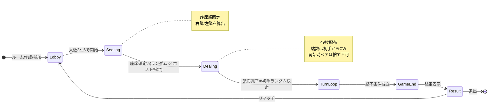
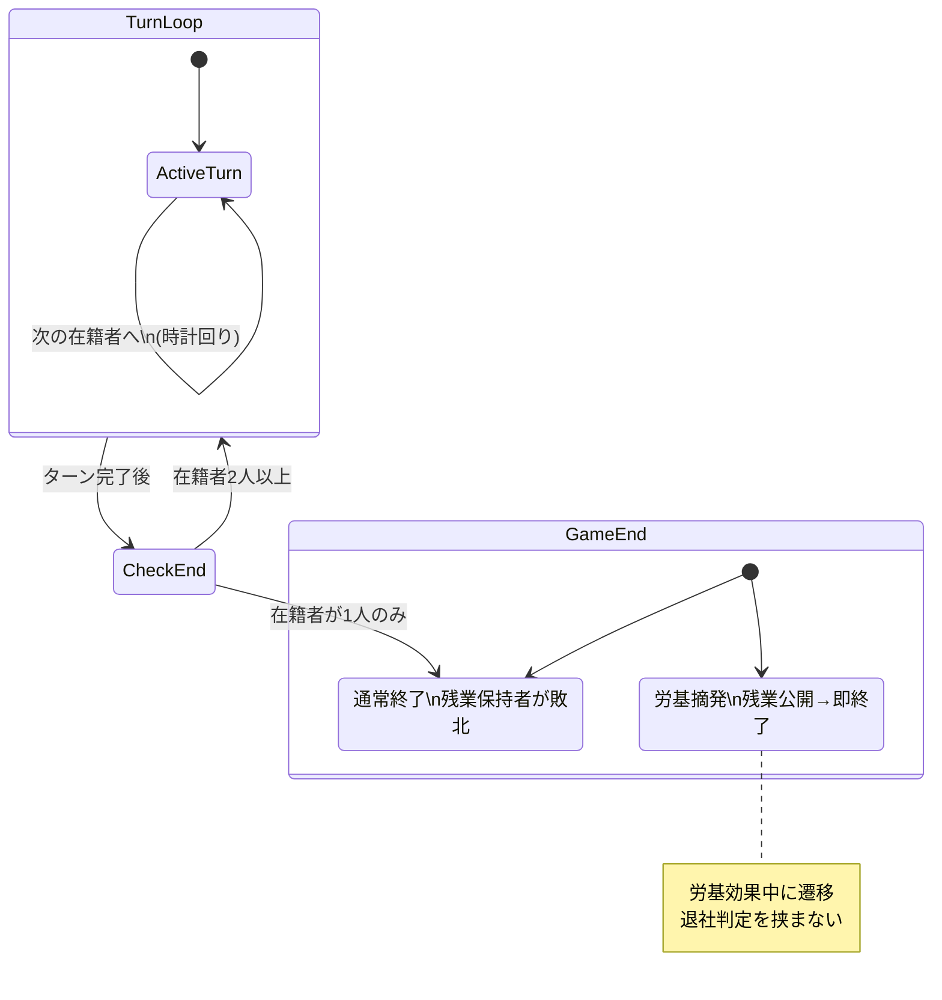
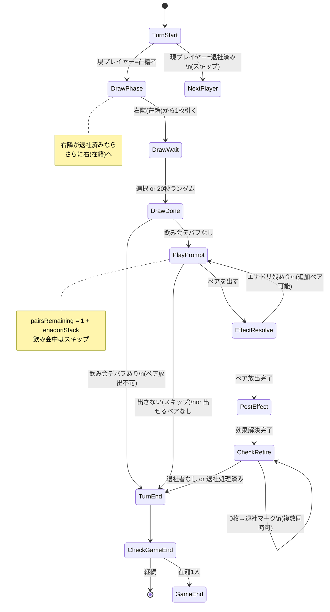
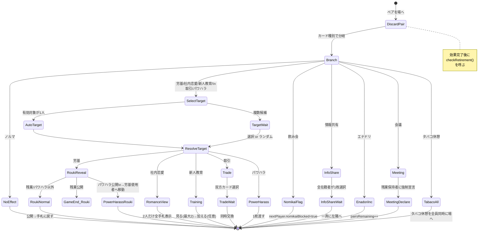
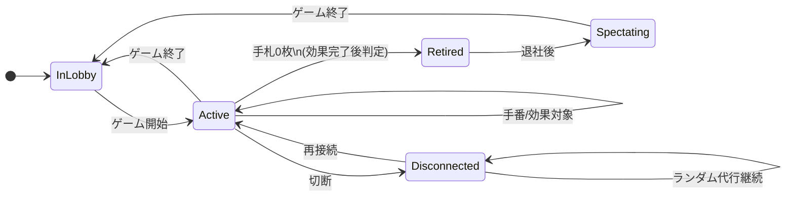
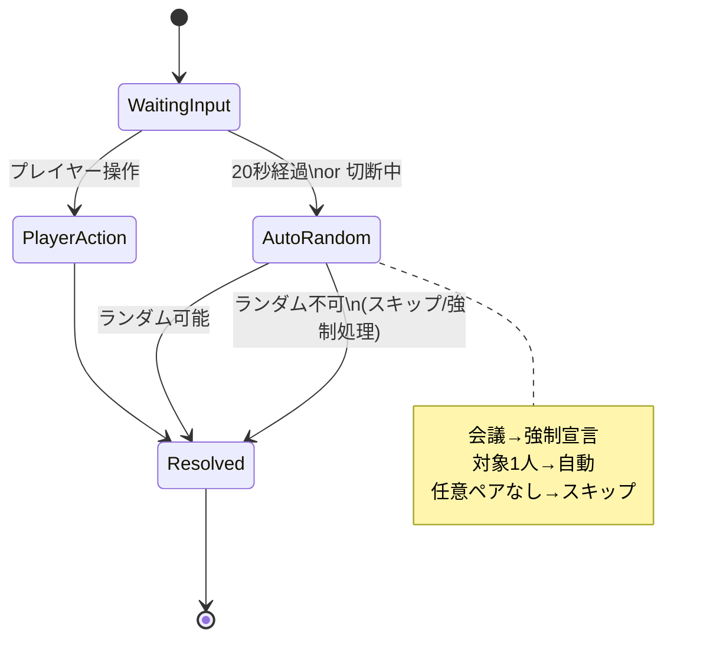
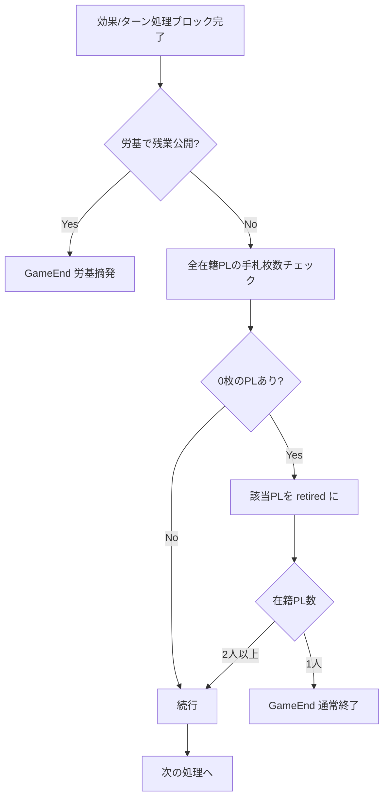
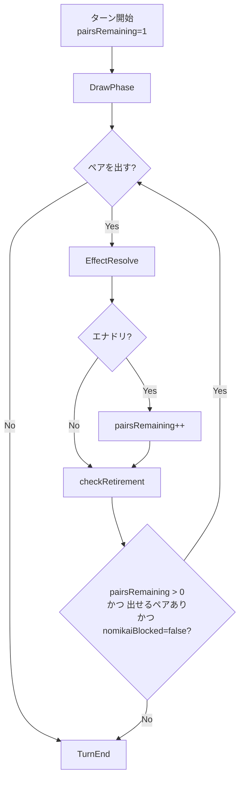

# 定時退社 — 状態遷移図（Web実装用）

> **参照:** `RULES_RECOGNITION.md`（確定ルール）
>
> **目的:** サーバー・クライアントの状態設計と EffectResolver の実装指針

---

## 1. 全体ライフサイクル



---

## 2. ゲーム終了判定（TurnLoop からの分岐）



| 終了パターン | トリガー                    | 結果                                                    |
| ------------ | --------------------------- | ------------------------------------------------------- |
| **通常終了** | 在籍プレイヤーが1人になった | 退社済み=勝者（順位あり）、残り1人=敗者（残業保持）     |
| **労基摘発** | 労基で「残業」が公開        | 労基使用者=大勝利、残業保持者=大敗北、退社済み=共同責任 |

---

## 3. 1ターンの状態遷移



### ターン内の状態変数（実装用）

| 変数              | 説明                                                     |
| ----------------- | -------------------------------------------------------- |
| `currentPlayerId` | 手番のプレイヤー                                         |
| `nomikaiBlocked`  | 飲み会によりペア放出不可（次の1ターンのみ）              |
| `pairsRemaining`  | このターンにまだ出せるペア数（初期値1、エナドリで+1/回） |
| `enadoriStack`    | エナドリのスタック数（上限なし）                         |
| `phase`           | `draw` \| `play` \| `effect`                             |

---

## 4. 効果解決（EffectResolve）のサブ状態

カード1組を場に出したあと、`phase = effect` に入り、カード種別ごとにサブフローが分岐する。



### 効果解決の共通パイプライン

```
playPair(cardType)
  → runEffect(cardType)     // 上記サブフロー
  → checkRoukiGameEnd()      // 残業公開時のみ即終了
  → checkRetirement()        // 全在籍者の手札==0 → 退社
  → if pairsRemaining > 0 → PlayPrompt へ
  → else → TurnEnd へ
```

---

## 5. カード効果ごとの遷移一覧

| カード     | 入力待ち状態                       | 解決                      | 特殊終了         |
| ---------- | ---------------------------------- | ------------------------- | ---------------- |
| ノルマ     | なし                               | 即完了                    | —                |
| 労基       | 対象PL + カード選択                | 公開→戻す or パワハラ移動 | 残業→**GameEnd** |
| 飲み会     | なし                               | 次PLに`nomikaiBlocked`    | —                |
| 社内恋愛   | 対象PL選択                         | 2人に全手札表示           | —                |
| 新人教育   | 対象PL + 見るカード + 加える(任意) | 移動 or スキップ          | —                |
| 情報共有   | **全在籍者**が1枚選択              | 一斉に左隣へ              | —                |
| 取引       | 対象PL + **双方**カード選択        | 同時交換                  | —                |
| エナドリ   | なし                               | `pairsRemaining++`        | —                |
| 会議       | 残業保持者の強制宣言               | 宣言表示                  | —                |
| パワハラ   | 対象PL + 渡すカード                | 1枚移動                   | —                |
| タバコ休憩 | なし（自動）                       | 全員のタバコ休憩を場へ    | —                |

---

## 6. プレイヤー状態



| 状態           | 手札 | 手番 | 効果の対象 | 情報共有 |
| -------------- | ---- | ---- | ---------- | -------- |
| `active`       | あり | ○    | ○          | ○        |
| `retired`      | 0枚  | ×    | ×          | ×        |
| `disconnected` | あり | 代行 | 代行       | 代行     |

---

## 7. 入力待ちとタイムアウト（20秒）



| 待ち状態 ID            | 待つ人      | タイムアウト                            |
| ---------------------- | ----------- | --------------------------------------- |
| `WAIT_DRAW`            | 手番PL      | 右隣からランダムに1枚                   |
| `WAIT_PLAY_OR_SKIP`    | 手番PL      | ペアあればランダム1組、なければスキップ |
| `WAIT_SELECT_TARGET`   | 効果使用者  | 有効対象からランダム                    |
| `WAIT_SELECT_CARD`     | 効果使用者  | 候補からランダム                        |
| `WAIT_INFO_SHARE`      | 全在籍者    | 未選択者はランダム                      |
| `WAIT_TRADE_BOTH`      | 使用者+対象 | 未選択はランダム                        |
| `WAIT_TRAINING_TAKE`   | 効果使用者  | 加える/加えないをランダム               |
| `WAIT_MEETING_DECLARE` | 残業保持者  | 強制宣言（即時）                        |

---

## 8. サーバー `GameState` 推奨スキーマ

```typescript
type GamePhase = "lobby" | "dealing" | "draw" | "play" | "effect" | "game_end";

type EffectStep =
  | "none"
  | "select_target"
  | "select_card"
  | "reveal"
  | "info_share"
  | "trade"
  | "training"
  | "meeting_declare"
  | "tabaco_dump";

interface GameState {
  phase: GamePhase;
  effectStep: EffectStep;
  effectCard: CardType | null;

  seats: PlayerId[]; // 円形座席順（index 0..n-1）
  currentSeatIndex: number;
  firstPlayerSeatIndex: number;

  players: Record<
    PlayerId,
    {
      status: "active" | "retired" | "disconnected";
      hand: CardInstance[];
    }
  >;

  discardPile: CardInstance[];
  pairsRemainingThisTurn: number;
  nomikaiBlockedPlayerId: PlayerId | null;

  pendingInput: {
    type: string;
    playerIds: PlayerId[];
    deadlineAt: number | null; // 20秒アイドル検知用
  } | null;

  result: GameResult | null;
}
```

---

## 9. 退社判定の呼び出しタイミング



**重要:** 効果の途中（カード移動中・情報共有の交換前など）では `checkRetirement()` を呼ばない。

---

## 10. エナドリ + 複数ペアのターン内ループ



---

## 11. 隣の算出（座席）

```
seatIndex: 0 .. n-1（円形）

rightOf(i) = seats[(i + 1) % n]
leftOf(i)  = seats[(i - 1 + n) % n]

nextActiveSeat(i):
  j = (i + 1) % n
  while players[seats[j]].status == "retired":
    j = (j + 1) % n
  return j

drawSourceSeat(i):
  j = rightOf(i)
  while players[seats[j]].status != "active":
    j = rightOf(indexOf(seats[j]))
  return j
```

---

## 12. 実装チェックリスト

- [ ] `phase` / `effectStep` / `pendingInput` の3層で状態を表現
- [ ] 効果完了後のみ `checkRetirement()` を呼ぶ
- [ ] 労基×残業は `checkRetirement()` より先に `GameEnd` へ
- [ ] 飲み会は `nomikaiBlockedPlayerId` を次ターン1回だけ立てる
- [ ] 情報共有・取引は複数PLの `pendingInput` を並行管理
- [ ] 20秒アイドル・切断は同一の `AutoRandom` パスを通す
- [ ] 対象1人のとき `WAIT_SELECT_TARGET` をスキップ
- [ ] 退社済みPLは全効果の対象外（タバコ休憩・情報共有も除外）

---

_作成日: 2026-06-25_
_参照: RULES_RECOGNITION.md_
