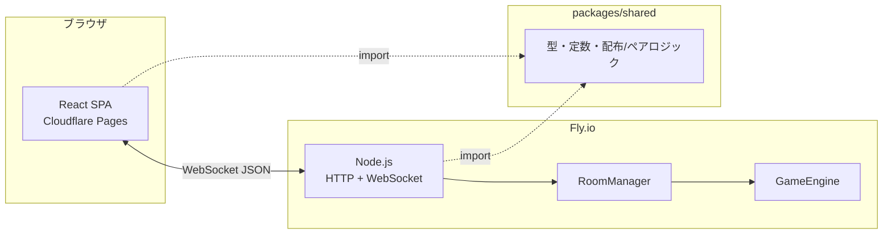

# 定時退社 Web版 — 技術・構成まとめ

> note などで「どう作ったか」を書くときのたたき台。  
> ゲームルール本体は [RULES_RECOGNITION.md](./RULES_RECOGNITION.md)、状態設計は [STATE_DIAGRAM.md](./STATE_DIAGRAM.md) を参照。

---

## 1. 何を作っているか

ボードゲーム「**定時退社**」（Mottainai Games）を、ブラウザだけで友達とオンライン対戦できる Web アプリ。

- **フロント**: 静的サイト（ルーム参加 UI・手札表示・操作）
- **バックエンド**: WebSocket ゲームサーバー（ルーム管理・ルール判定・同期）
- **方針**: ゲームロジックはサーバーが正（サーバー権威）。クライアントは表示と入力送信のみ

---

## 2. 技術スタック一覧

| 領域 | 技術 |
|------|------|
| 言語 | TypeScript |
| パッケージ管理 | pnpm ワークスペース（モノレポ） |
| フロント | React 19 + Vite 6 |
| スタイル | 素の CSS（UI ライブラリなし） |
| サーバー | Node.js 20+、`ws`（WebSocket）、`node:http` |
| 共有ロジック | `@teijitaisha/shared` パッケージ |
| テスト | Vitest（サーバー・共有ロジック） |
| Lint / Format | ESLint 9 + Prettier |
| フロント配信 | Cloudflare Pages |
| API 配信 | Fly.io（Docker） |
| CI/CD | GitHub Actions（lint / test / build → 自動デプロイ） |

---

## 3. リポジトリ構成

```
定時退社web/
├── apps/
│   ├── web/                 # フロントエンド（Vite + React）
│   │   └── src/
│   │       ├── App.tsx              # ホーム / ルーム画面の切り替え
│   │       ├── GameScreen.tsx       # ロビー・対局中 UI
│   │       ├── useGameSocket.ts     # WebSocket 接続・再接続・状態管理
│   │       ├── session.ts           # localStorage セッション永続化
│   │       └── …（カード UI、ロビー、SNS 共有など）
│   └── server/              # ゲームサーバー
│       └── src/
│           ├── index.ts             # エントリポイント
│           ├── app.ts               # HTTP + WebSocket サーバー組み立て
│           ├── room-manager.ts      # ルーム・プレイヤー・メッセージ振り分け
│           ├── game-engine.ts       # ゲームルール・ターン進行・効果処理
│           └── *.test.ts            # 単体・結合テスト
├── packages/
│   └── shared/              # クライアントとサーバーで共有
│       └── src/
│           ├── types.ts             # WebSocket メッセージ型
│           ├── game.ts              # GameView・結果型
│           ├── cards.ts             # カード定義・効果テキスト
│           ├── deal.ts              # 配布ロジック
│           ├── pairs.ts             # ペア判定
│           ├── constants.ts         # 人数上限・タイムアウト等
│           └── player-name.ts       # 表示名正規化
├── scripts/                 # カードアイコン同期など
├── .github/workflows/       # CI / デプロイ
├── fly.toml                 # 本番 API（Fly.io）
├── fly.staging.toml         # Staging API
└── DEPLOY_*.md              # デプロイ手順
```

---

## 4. システム構成（ざっくり）



- **フロントと API は別ホスト**（Pages と Fly.io を CORS / WSS で接続）
- ビルド時に `VITE_WS_URL` で WebSocket の接続先を注入

---

## 5. 通信の仕組み（WebSocket）

### プロトコル

JSON メッセージを `type` フィールドで判別。型定義は `packages/shared/src/types.ts` に集約。

**クライアント → サーバー（例）**

| type | 用途 |
|------|------|
| `create_room` / `join_room` | ルーム作成・参加（オブザーバー参加も可） |
| `rejoin_room` | タブ閉じ・再接続後の復帰（sessionToken） |
| `start_game` | ホストがゲーム開始 |
| `draw_card` / `play_pair` / `skip_play` | ターン操作 |
| `select_target` / `select_card` | カード効果の対象選択 |
| `reorder_seats` / `shuffle_seats` | ロビーでプレイ順変更（ホストのみ） |
| `kick_player` / `rename_player` | ロビーで追い出し・名前変更（ホストのみ） |
| `ping` | キープアライブ |

**サーバー → クライアント（例）**

| type | 用途 |
|------|------|
| `room_created` / `room_joined` / `room_rejoined` | 参加成功 + sessionToken |
| `room_updated` | ルーム人数・名前などの変更 |
| `game_started` | ゲーム開始 |
| `game_state` | プレイヤーごとの `GameView`（手札は自分だけ見える） |
| `room_left` / `room_kicked` | 退出・追い出し |
| `error` | 操作エラー |

### 同期の流れ

1. クライアントが操作メッセージを送信
2. `RoomManager` が権限・フェーズを確認し `GameEngine` に委譲
3. サーバーが `room_updated` と、各プレイヤー向け `game_state` をブロードキャスト
4. クライアントは `GameView` をそのまま描画（推測で進めない）

### 再接続

- 参加時に `sessionToken` を発行し、`localStorage` に保存
- 切断後は指数バックオフで WebSocket 再接続 → `rejoin_room` で復帰
- 20 秒以上切断が続くと CPU 代行対象になる（`IDLE_TIMEOUT_MS`）

---

## 6. サーバー側の責務分担

### `RoomManager`（`room-manager.ts`）

- ルームコード生成（6 文字・紛らわしい文字除外）
- プレイヤー / CPU / オブザーバーの参加・退出・追い出し
- ホスト権限（開始・CPU 追加・座席順・名前変更など）
- WebSocket と `playerId` の紐付け
- 10 分無操作ルームの自動解散
- `GameEngine` インスタンスの保持

### `GameEngine`（`game-engine.ts`）

- フェーズ管理: `lobby` → `dealing` → `draw` / `play` / `effect` → `game_end`
- 座席順（円卓）・左隣から引く・ペア出し・カード効果
- タイムアウト時の自動処理（スキップ等）
- プレイヤーごとの `getView(playerId)` で情報を秘匿（手札は本人のみ等）
- オブザーバーモード用の全員手札公開ビュー

### `createApp`（`app.ts`）

- `/health` ヘルスチェック
- WebSocket メッセージのパース・ルーティング
- CPU ターンの非同期実行（待ち時間・ホストの「クリック送り」対応）
- レートリミット（ルーム作成・参加）

---

## 7. フロント側の責務分担

### `useGameSocket`

- WebSocket ライフサイクル（接続・ping・再接続）
- `room`（ロビー情報）と `gameView`（対局情報）の state 管理
- サーバーメッセージのディスパッチ

### `GameScreen`

- ロビー UI（メンバー一覧・プレイ順 D&D・CPU・開始）
- 対局中 UI（手札・場・効果・タイマー）
- ハンバーガーメニュー（ログ・プレイ順・退出確認など）

### UI の特徴

- **サーバーから受け取った `GameView` を信頼**して描画
- 手札の並べ替えは `reorderable-hand-fan.tsx`（Pointer Events）
- カード画像は `public/` + `scripts/sync-card-icons.mjs` で同期
- 招待は URL クエリ `?code=XXXXXX` と X 共有ボタン

---

## 8. 共有パッケージ（`@teijitaisha/shared`）の役割

クライアントとサーバーで **同じ型・同じ定数・同じ純粋関数** を使うことで:

- WebSocket の型安全性
- 配布・ペア判定のテストを1か所で実施
- クライアントにルールを漏らさず、表示用ラベルだけ共有

主なエクスポート:

- `CARD_TYPES` / `CARD_LABELS` / `CARD_EFFECTS`
- `dealHands` / `getPairableTypes`
- `MIN_PLAYERS`（2）/ `MAX_PLAYERS`（48）/ 推奨 3〜6 人
- `ClientMessage` / `ServerMessage` / `GameView`

---

## 9. 主な機能と実装の対応

| 機能 | 概要 |
|------|------|
| ルームコード参加 | 6 文字コード + 招待 URL |
| 2〜48 人プレイ | 推奨外人数は警告表示。配布は共有 `deal.ts` |
| CPU 参加 | ホストがロビーで追加。速度 4x〜クリック送り |
| オブザーバー | 最大 20 人。ゲーム中は全員手札公開ビュー |
| ロビー座席編集 | ホストが D&D / シャッフル。開始時にその順を採用 |
| ホスト管理 | 追い出し・名前変更（CPU は `名前（CPU）` 形式） |
| 切断・復帰 | sessionToken + 自動再接続 |
| 労基（ろうき）演出 | `rouki-reveal.tsx` で全画面演出 |
| SNS 共有 | X  intent URL（招待・結果・告知） |

---

## 10. デプロイ構成

| 環境 | Web（Pages） | API（Fly.io） |
|------|----------------|----------------|
| Staging | `teijitaisha-web-staging` / `develop` ブランチ | `teijitaisha-web-api-staging` |
| Production | `teijitaisha-web` / `main` ブランチ | `teijitaisha-web-api` |

**CI（`.github/workflows/deploy.yml`）**

1. `pnpm lint` → `pnpm test` → `pnpm build`
2. `develop` push → Staging へ Web + API 自動デプロイ
3. `main` push → Production へ自動デプロイ

詳細手順: [DEPLOY_STAGING.md](./DEPLOY_STAGING.md) / [DEPLOY_PRODUCTION.md](./DEPLOY_PRODUCTION.md)

---

## 11. 開発の回し方

```bash
pnpm install

# ターミナル 1: API
pnpm dev:server    # ws://localhost:8080

# ターミナル 2: フロント
cp apps/web/.env.example apps/web/.env.local
pnpm dev:web       # http://localhost:5173
```

```bash
pnpm test          # Vitest（サーバー中心）
pnpm lint
pnpm build         # shared → server → web
```

---

## 12. テスト方針

- **`game-engine.test.ts`**: ターン進行・各カード効果・終了条件
- **`game-engine.48players.test.ts`**: 大人数での開始・配布
- **`room-manager.test.ts`**: 参加・復帰・ホスト継承・座席・追い出し
- **`ws-integration.test.ts`**: WebSocket で作成→参加→再接続
- **`deal.test.ts` / `player-name.test.ts`**: 共有パッケージの純粋関数

フロントは手動確認中心（E2E フレームワークは未導入）。

---

## 13. note に書くときのストーリー例

1. **きっかけ** — ボードゲーム「定時退社」を離れていても遊びたい
2. **アーキテクチャ選定** — リアルタイム同期が必要なので WebSocket + サーバー権威
3. **モノレポ** — 型とルールの一部を `shared` に寄せてフロント/サーバーのズレを防ぐ
4. **ゲームエンジン** — 状態機械でフェーズ管理（STATE_DIAGRAM 参照）
5. **UX** — 再接続・オブザーバー・ロビー座席編集・スマホ向け UI
6. **インフラ** — 静的フロントは Pages、常時接続 API は Fly.io
7. **学び / 今後** — テストの重要性、48 人対応のバランスなど

---

## 14. 関連ドキュメント

| ファイル | 内容 |
|----------|------|
| [README.md](./README.md) | クイックスタート |
| [RULES_RECOGNITION.md](./RULES_RECOGNITION.md) | ゲームルール（実装の正） |
| [STATE_DIAGRAM.md](./STATE_DIAGRAM.md) | 状態遷移・EffectResolver 設計 |
| [DEPLOYMENT.md](./DEPLOYMENT.md) | デプロイ方針概要 |
| [DEPLOY_STAGING.md](./DEPLOY_STAGING.md) | Staging 初回・CI 設定 |
| [DEPLOY_PRODUCTION.md](./DEPLOY_PRODUCTION.md) | 本番デプロイ |

---

*最終更新: リポジトリの現行実装に基づく。機能追加時はこのファイルも随時更新してください。*
